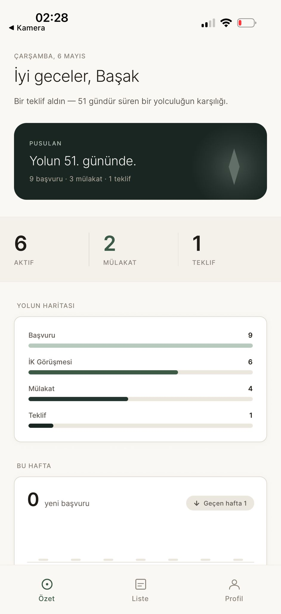
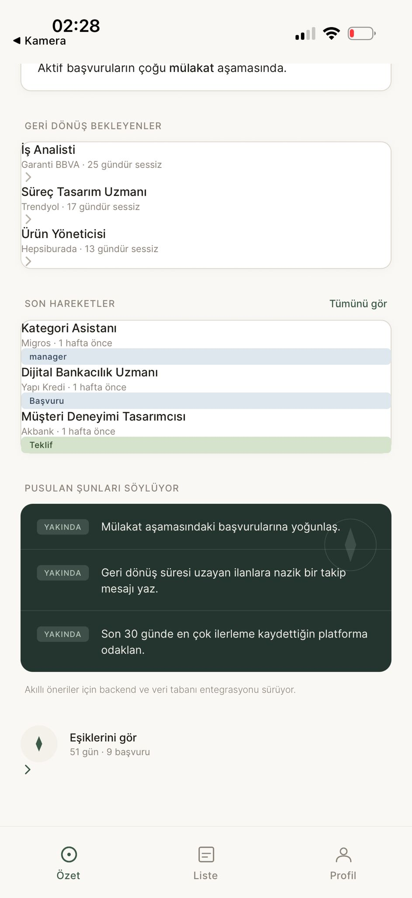
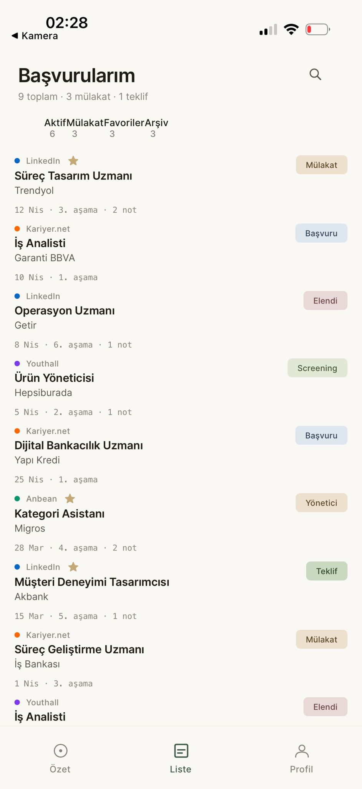
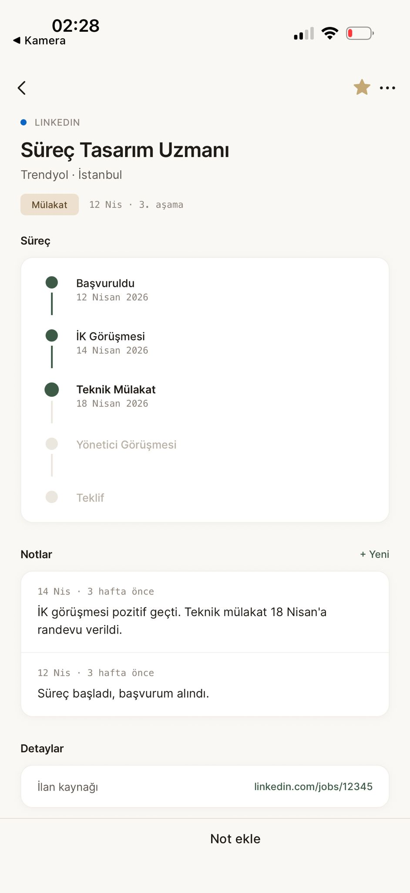
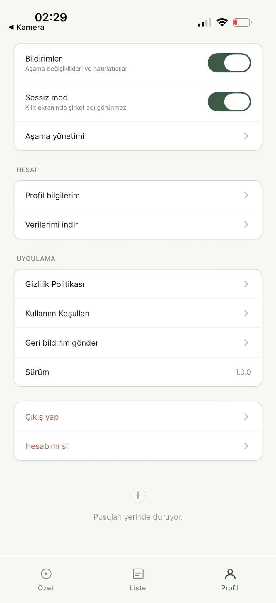

<div align="center">

# 🧭 Applyze — Kariyer Pusulası

**İş başvurularını takip et, AI ile örüntüleri gör, kendi yönünü bul.**

İş arayanlar için yapay zeka destekli başvuru takip ve yön bulma uygulaması.

[**🌐 Canlı Uygulama → applyze.vercel.app**](https://applyze.vercel.app)

`Expo (Web + Mobil)` · `Supabase` · `Google Gemini` · `TypeScript`

</div>

---

## ✨ Applyze nedir?

İş arama süreci dağınıktır: onlarca başvuru farklı platformlara yapılır, hangisinin ne aşamada olduğu unutulur, hangi alanda güçlü olunduğu görülmez. **Applyze**, tüm başvuruları tek yerde toplar ve yapay zekâ ile bu veriyi **anlamlı bir yön duygusuna** çevirir — bir pusula gibi.

Statik bir liste değil; başvuru verini okuyup sana **nerede tıkandığını, hangi alanda güçlü olduğunu ve sıradaki adımı** söyleyen etkileşimli bir asistandır.

---

## 🎯 Problem & Hedef Kitle

**Kim:** Aktif iş arayan kişiler — özellikle yeni mezunlar ve kariyer geçişi yapanlar (ilk kullanıcı kitlesi: Türkiye'deki üniversite öğrencileri/yeni mezunlar).

**Problem:** İş arayan biri aynı anda 30–60 başvuruyu LinkedIn, Kariyer.net, şirket siteleri gibi farklı yerlerde yürütür. Sonuç:
- Hangi başvuru ne aşamada, kaç gündür sessiz — takip edilemez.
- Excel'le tutmak zahmetli ve içgörü vermez.
- "Neyi yanlış yapıyorum, hangi alanda güçlüyüm?" sorusu yanıtsız kalır.

**Ne zaman zorlanır:** Başvurular biriktikçe (özellikle 10+ başvurudan sonra) süreç kontrolden çıkar ve motivasyon düşer.

---

## 💡 Çözüm

> **Applyze, dağınık iş başvurularını tek panelde toplar ve yapay zekâ ile sana kişisel bir yön haritası çıkarır.**

Kullanıcıya kattığı değer: takip yükünü sıfırlar, süreçteki darboğazı görünür kılar ve "sırada ne var?" sorusuna somut cevap verir.

---

## 📸 Ekran Görüntüleri

<p align="center">
  
  
  
</p>
<p align="center">
  
  
  
</p>
<p align="center"><em>Giriş · Özet (Pusula) · AI önerileri · Liste · Başvuru detayı · Profil</em></p>

---

## 🚀 Temel Özellikler

| Özellik | Açıklama |
|---|---|
| 📥 **Başvuru takibi** | Şirket, pozisyon, platform, aşama, tarih, not — tek kartta. Özel aşamalar eklenebilir. |
| 🧭 **Pusula (AI içgörü)** | Gemini, başvuru hunisini ve dönüşüm oranlarını yorumlar; güçlü alanını, darboğazını ve sıradaki adımı söyler. |
| 📄 **CV ↔ İlan uyum analizi (AI)** | PDF CV'yi okur, ilanla karşılaştırır, uyum skoru ve gerekçe üretir. |
| 🔗 **İlan linkinden otomatik doldurma (AI)** | İlan metnini AI ile çözüp formu otomatik doldurur. |
| 📊 **Yolculuğum / Eşikler** | İlk başvuru → ilk geri dönüş → ilk mülakat → ilk teklif eşikleri + huni & dönüşüm istatistikleri. |
| 📁 **Toplu içe aktarma** | Excel/CSV ile yüzlerce başvuruyu tek seferde ekler (tekrar kontrollü). |
| ⏰ **Hatırlatma & takip** | Sessiz kalan başvurular için takip aksiyonları. |
| 🔐 **Giriş** | E-posta + şifre ve Google ile giriş. Verilerini indirme & hesap silme. |

---

## 🤖 Yapay Zekâ Mimarideki Yeri

Yapay zekâ uygulamanın **çekirdek mantığında** ve **sunucu katmanında** çalışır — istemcide değil:

```
Kullanıcı (Expo Web/Mobil)
        │  giriş token'ı ile çağrı
        ▼
Supabase Edge Functions (Deno API katmanı)
        │  şirket adı GÖNDERİLMEDEN, sadece sayısal teşhis
        ▼
Google Gemini API (2.5-flash → flash-lite yedek)
```

- **API anahtarı asla istemcide değildir** — tüm Gemini çağrıları Edge Function üzerinden yapılır.
- **Gizlilik önceliklidir** — AI'a şirket adları/kişisel notlar gönderilmez; yalnızca oran, sayı ve alan/sektör etiketleri gider.
- **Dayanıklılık** — önce `gemini-2.5-flash`, boş/hatalı dönerse otomatik `gemini-2.5-flash-lite`'a düşer; sonuçlar önbelleğe alınarak kota korunur.

---

## 🏗️ Mimari & Teknoloji

**Frontend (`/frontend`)** — Expo (React Native) + Expo Router, tek kod tabanından **web + mobil**. TypeScript, NativeWind. Vercel'de statik export ile yayında.

**Backend (`/backend`)** — Supabase: Postgres + Row Level Security, Auth, **Edge Functions (Deno) API katmanı**, Storage (CV'ler), pg_cron. Backend platformdan bağımsız bir API'dir; bugün web'e, yarın mobil app'e aynı uçları sunar.

**AI** — Google Gemini, Edge Functions üzerinden.

> Detaylı gerekçeler ve AI destekli geliştirme süreci için: [`prodocs/tech-stack.md`](prodocs/tech-stack.md)

---

## 📂 Repo Yapısı

```
.
├── frontend/        # Expo (React Native) arayüz — web + mobil
├── backend/         # Supabase: edge functions (Deno API) + migrations
├── prodocs/         # Geliştirme referans dökümanları (PRD, Plan, tech-stack…)
├── .gitignore
├── README.md        # bu dosya
└── frontend/.env.example
```

---

## ⚙️ Kurulum & Çalıştırma

### Gereksinimler
- Node.js 18+, npm
- Bir Supabase projesi (ücretsiz)
- Google Gemini API anahtarı

### 1) Frontend (yerel geliştirme)
```bash
cd frontend
npm install
cp .env.example .env        # değerleri kendi Supabase projenle doldur
npm run web                 # web için
# npm run ios / npm run android   # mobil için
```

`.env` içeriği:
```
EXPO_PUBLIC_SUPABASE_URL=https://<proje-ref>.supabase.co
EXPO_PUBLIC_SUPABASE_ANON_KEY=<anon-key>
```

### 2) Backend (Supabase)
```bash
cd backend
supabase functions deploy --project-ref <proje-ref>
```
Edge Function gizli değişkenleri (Supabase → Edge Functions → Secrets):
`GEMINI_API_KEY` (Google Gemini anahtarı).

### 3) Web Deploy (Vercel)
- Root Directory: `frontend`
- Build Command: `npx expo export -p web`
- Output Directory: `dist`
- Ortam değişkenleri: `EXPO_PUBLIC_SUPABASE_URL`, `EXPO_PUBLIC_SUPABASE_ANON_KEY`
- `frontend/vercel.json` derin link/yenileme 404'larını çözer (tüm rotaları SPA'ya yönlendirir).

---

## 🗺️ Yol Haritası

- App Store & Play Store yayını (EAS build)
- Push bildirimleri (uçtan uca)
- Gemini ücretli katmana geçiş (ölçeklenince) + premium özellikler
- Çoklu dil

---

## 📚 Dökümanlar

| Doküman | İçerik |
|---|---|
| [`prodocs/PRD.md`](prodocs/PRD.md) | Ürün gereksinimleri — problem, kullanıcı, özellikler |
| [`prodocs/Plan.md`](prodocs/Plan.md) | Kullanıcı hikâyelerine bölünmüş teknik plan |
| [`prodocs/tech-stack.md`](prodocs/tech-stack.md) | Teknolojiler, seçim gerekçeleri, AI destekli geliştirme |
| [`prodocs/DesignSystem.md`](prodocs/DesignSystem.md) | Renk paleti, tipografi, component kuralları |
| [`prodocs/Progress.md`](prodocs/Progress.md) | Kararlar, kilometre taşları ve hata/çözüm günlüğü |

---

<div align="center">

**Applyze** — *Sadece bir takipçi değil. Bir pusula.* 🧭

Future Talent 2026 · Yapay Zeka ile Ürün Geliştirme Bitirme Projesi

</div>
